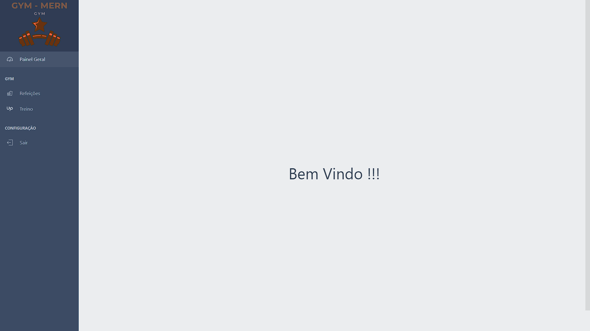
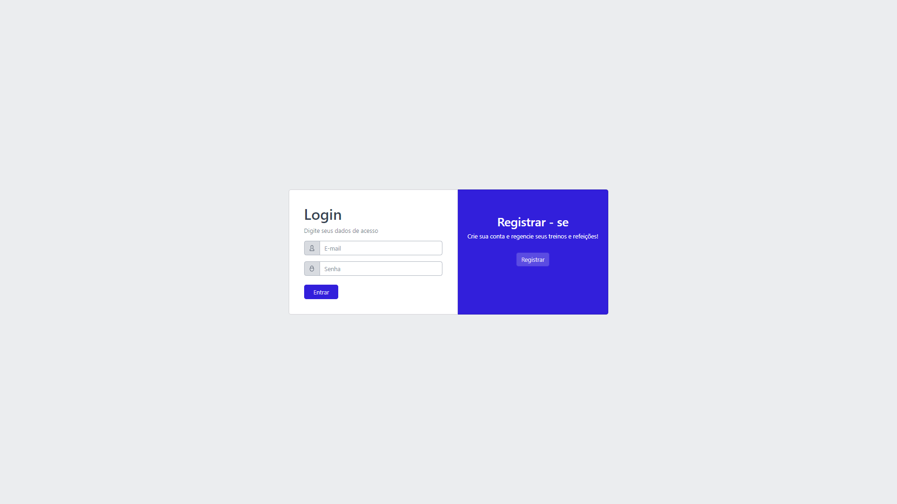
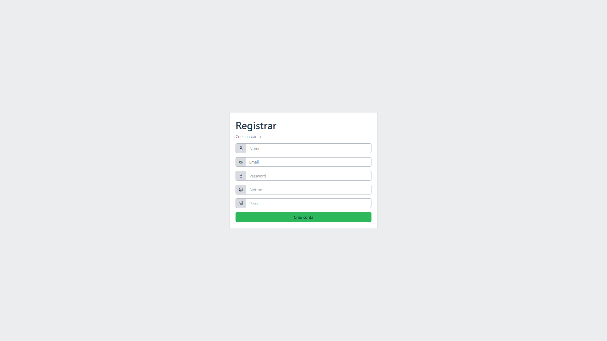
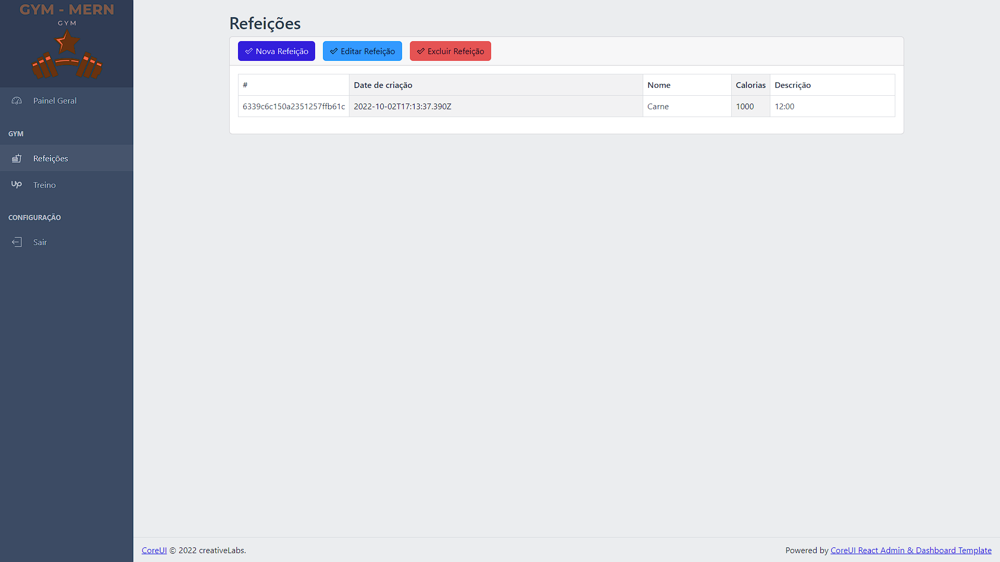
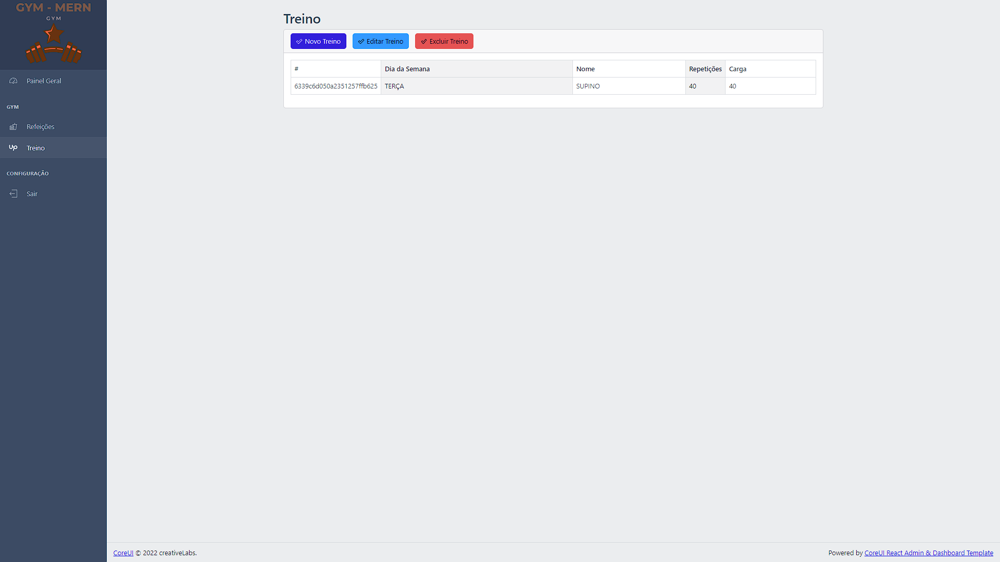

<h1 align="center">
    GYM - MERN 🏪
</h1>

<p align="center">
  <a href="#tecnologias">Tecnologias</a>&nbsp;&nbsp;&nbsp;|&nbsp;&nbsp;&nbsp;
  <a href="#projeto">Projeto</a>&nbsp;&nbsp;&nbsp;|&nbsp;&nbsp;&nbsp;
  <a href="#rodando">Rodando</a>&nbsp;&nbsp;&nbsp;|&nbsp;&nbsp;&nbsp;
  <a href="#como-contribuir">Como contribuir</a>&nbsp;&nbsp;&nbsp;|&nbsp;&nbsp;&nbsp;
  <a href="#license">Licença</a>&nbsp;&nbsp;&nbsp;|&nbsp;&nbsp;&nbsp;
  <a href="#Overview">Overview</a>&nbsp;&nbsp;&nbsp;|&nbsp;&nbsp;&nbsp;
</p>

<a id="tecnologias"></a>

## Tecnologias 🖥️

<div align="center">

  [](https://skills.thijs.gg)
</div>

<a id="projeto"></a>

## Projeto 📕

Projeto FullStack feito em Nodejs, React e Mongodb para gerenciar sua rotina na academia.

<a id="rodando"></a>

## Rodando o App 🚀

Tenha em mente que você possua:

    - Um editor de código
    - NodeJS
    - Um cloud de mongodb


### Rodando Nativamente 🌅

1. Primeiro instale todas as dependências, utilize o gerenciador de pacotes a seu gosto tanto na pasta do backend quanto na pasta do frontend.

```bash
npm install
# ou
yarn install
```

2. Agora abra o diretório backend e digite no terminal:

```bash
npm run dev
# ou
yarn dev
```

3. Agora abra o diretório frontend e digite no terminal:
```bash
npm start
# ou
yarn start
```

<a id="Overview"></a>

## 🍷 Overview







<a id="como-contribuir"></a>

## 🤔 Como contribuir

- Faça um fork desse repositório;
- Cria uma branch com a sua feature: `git checkout -b minha-feature`;
- Faça commit das suas alterações: `git commit -m 'feat: Minha nova feature'`;
- Faça push para a sua branch: `git push origin minha-feature`.

Depois que o merge da sua pull request for feito, você pode deletar a sua branch.

<a id="license"></a>

### 🔖 Licença

Caso queira conferir a licença do projeto, só olhar esse arquivo [LICENSE](./LICENSE)